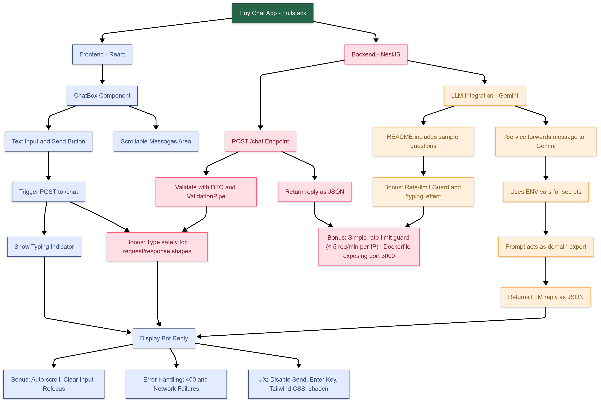

<p align="center">
  <a href="http://nestjs.com/" target="blank"></a>
</p>

<p align="center">A tiny fullstack chat app built with <a href="https://nestjs.com/" target="_blank">NestJS</a> and <a href="https://react.dev/" target="_blank">React</a>, featuring real-time token streaming.</p>

<p align="center">
  <a href="https://www.npmjs.com/package/@nestjs/core"></a>
  <a href="https://github.com/nestjs/nest/blob/master/LICENSE"></a>
  <a href="https://github.com/nestjs/nest"></a>
</p>

---

## 🎥 Demo Video

<p align="center">
  <a href="https://youtu.be/OGm4u-IeRfM" target="_blank">
    
  </a>
</p>

> 📽️ Click the image above to watch the app in action.

---

## 🧠 About the Project

<p align="center">
  
</p>

This is a **live-coding-style chat application** built with:

- **Backend**: NestJS + RxJS
- **Frontend**: React 18 + Vite + Tailwind
- **LLM integration**: via Gemini or OpenAI
- **Bonus**: Token-by-token streaming (SSE), rate limiting, Docker support

---

## 🗂️ Project Structure

```
tiny-chat-app-fullstack/
├── backend/   # NestJS API with LLM integration
├── frontend/  # React app with typing effect and SSE
├── .env.example
├── docker-compose.yml (optional)
└── README.md
```

---

## 🚀 Getting Started

### 1. Clone and install dependencies

```bash
git clone https://github.com/your-username/tiny-chat-app-fullstack.git
cd backend
npm install
```

### 2. Environment setup

Create a `.env` file in the backend root:

```env
PORT=3000
LLM_API_KEY=your_api_key
LLM_MODEL=gemini-1.5-flash
THROTTLE_TTL=60
THROTTLE_LIMIT=5
```

> 🧪 You can test using either OpenAI or Gemini endpoints. Prompt templates are domain-specific.

---

## 📡 Run the Backend (NestJS)

```bash
# Development
npm run start:dev
```

---

## 💬 Run the Frontend (React)

```bash
cd ../frontend
npm install
npm run dev
```

Add `.env` in `/frontend` with:

```env
VITE_API_URL=http://localhost:3000
```

---

## 💡 Features

- ✅ Simple ChatBox UI (user on right, bot on left)
- ✅ Auto-scroll and "Typing..." indicator
- ✅ SSE Streaming with token-by-token updates
- ✅ Handles network errors gracefully
- ✅ Request validation via DTO + ValidationPipe
- ✅ Rate limiting (configurable via `.env`)
- ✅ Fully typed with TypeScript

---

## 🧪 Sample Questions

```json
[
  {
    "question": "Is there carrot in Brazil?",
    "expected": "Yes."
  },
  {
    "question": "What is the difference between tapioca and cassava starch?",
    "expected": "Tapioca is made with hydrated starch (goma)..."
  },
  {
    "question": "How do you prepare traditional rice and beans?",
    "expected": "Sauté garlic and onion..."
  }
]
```

---

## 🧵 Token Streaming

This project uses **Server-Sent Events (SSE)** for streaming LLM replies token by token. The backend returns a stream like:

```ts
return new Observable<MessageEvent>((observer) => {
  tokens.forEach((token, i) => {
    setTimeout(() => observer.next({ data: token }), i * 50);
  });
  setTimeout(() => {
    observer.next({ data: "[[END]]" });
    observer.complete();
  }, tokens.length * 50 + 100);
});
```

---

## 🐳 Docker Support

You can run the project by running the following command at the root folder:

```bash
docker compose up
```

!! ## IMPORTANT: Make sure you have the .env file in the backend folder.

---

## 📦 Scripts

```bash
# Backend
npm run start:dev        # Watch mode
npm run test             # Unit tests
npm run test:e2e         # e2e tests
npm run test:cov         # Coverage

# Frontend
npm run dev              # Vite dev server
npm run build            # Production build
```

---

## 🧷 License

MIT © Felipe Figueiredo — Adapted from NestJS and Gemini examples.

> If you find this useful, feel free to ⭐ the repo and connect with me on [LinkedIn](https://linkedin.com/in/fjnfigueiredo).
